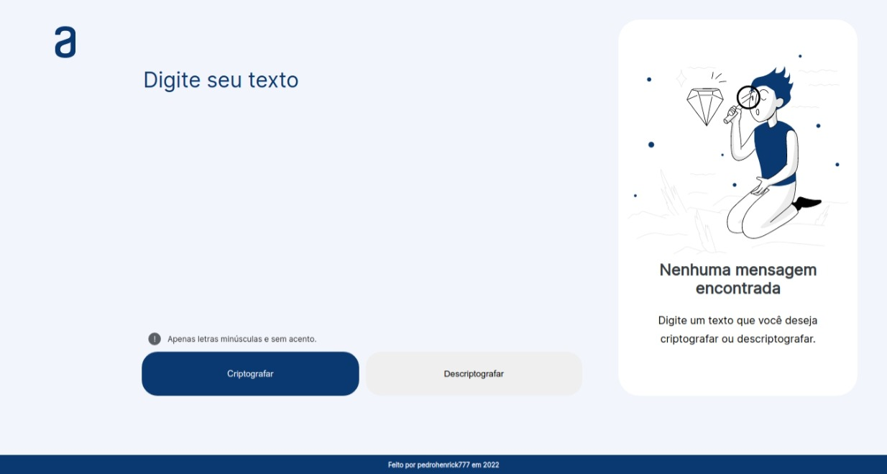
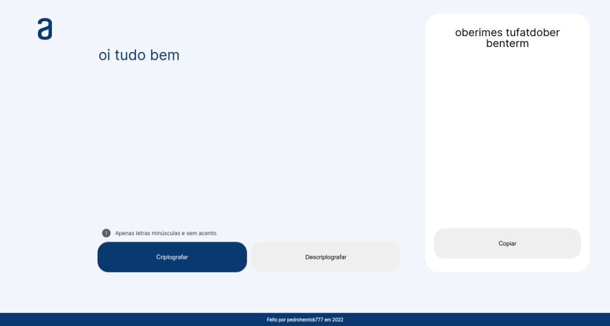

# Codificador de texto

Projeto feito durante a primeira sprint do Curso Oracle ONE na Alura. Consiste em um site onde é possível criptografar um texto, assim como descriptografar-lo em seguida.

Esse projeto me ajudou a consolidar meus conhecimentos em CSS3, visto que eu não tinha tanta prática com o mesmo, assim como também conceitos de HTML5 e Javascript.

## Imagens

Tela inicial

## Badge do projeto

